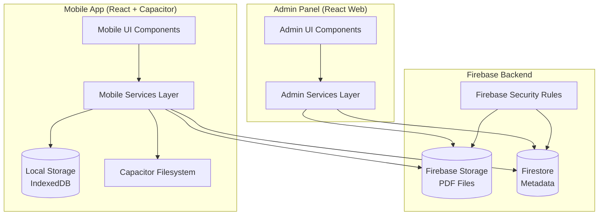
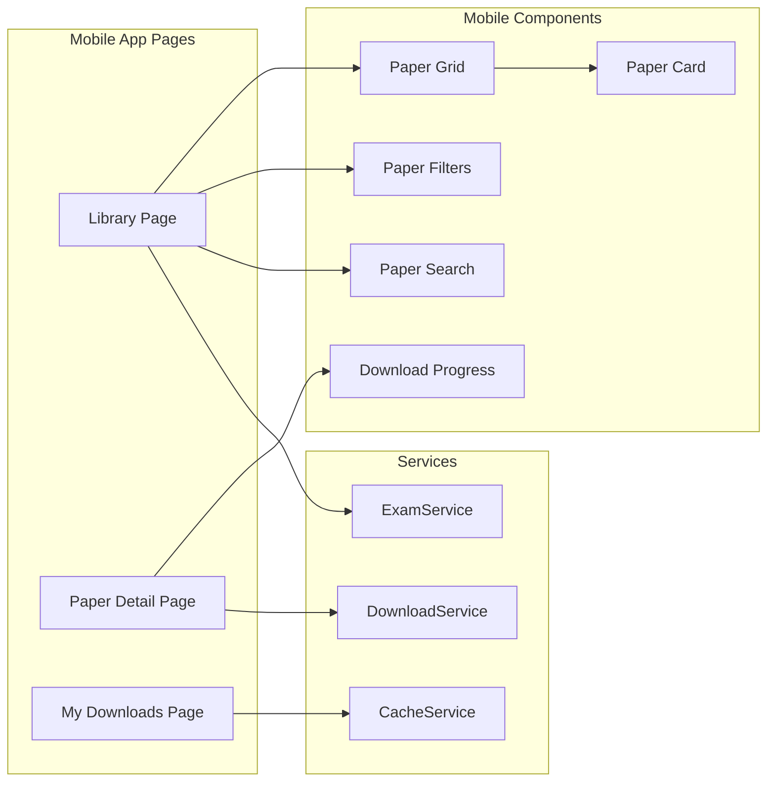

# Design Document: Exam Library

## Overview

The Exam Library feature extends the ScoreTarget mobile application with cloud-based exam paper management. The system consists of three main components:

1. **Mobile Student Interface**: React + Capacitor app for browsing, searching, filtering, downloading, and viewing exam papers
2. **Firebase Backend**: Cloud storage (Firebase Storage) for PDF files and database (Firestore) for metadata
3. **Web Admin Panel**: React-based web interface for content management

The architecture prioritizes offline-first functionality for students while maintaining a small app footprint by storing PDFs remotely. The system must operate within Firebase's free tier constraints (5GB storage, 1GB/day bandwidth).

### Key Design Principles

- **Offline-First**: Students can access downloaded papers without internet connectivity
- **Small Footprint**: PDFs stored remotely, only metadata cached locally
- **Simple Admin**: Single administrator with straightforward CRUD operations
- **Firebase Free Tier**: Careful quota management and monitoring
- **Consistent UX**: Matches existing ScoreTarget design system
- **Cross-Platform**: Works on Android and iOS via Capacitor

## Architecture

### System Architecture Diagram



### Component Architecture



### Data Flow

**Browse Flow:**
1. Student opens Library tab
2. ExamService fetches metadata from Firestore
3. CacheService stores metadata in IndexedDB
4. UI renders paper grid with cached data
5. Offline: UI renders from IndexedDB only

**Download Flow:**
1. Student taps Download button
2. DownloadService checks device storage
3. Downloads PDF from Firebase Storage
4. Saves to device filesystem via Capacitor
5. Updates local database with download status
6. Increments download count in Firestore

**Admin Upload Flow:**
1. Administrator selects PDF and fills metadata
2. AdminService uploads PDF to Firebase Storage
3. Creates Firestore document with metadata
4. Generates unique file path and stores URL

## Firebase Configuration

### Firebase Project Setup

```typescript
// src/lib/firebase.ts
import { initializeApp } from 'firebase/app';
import { getFirestore } from 'firebase/firestore';
import { getStorage } from 'firebase/storage';

const firebaseConfig = {
  apiKey: import.meta.env.VITE_FIREBASE_API_KEY,
  authDomain: import.meta.env.VITE_FIREBASE_AUTH_DOMAIN,
  projectId: import.meta.env.VITE_FIREBASE_PROJECT_ID,
  storageBucket: import.meta.env.VITE_FIREBASE_STORAGE_BUCKET,
  messagingSenderId: import.meta.env.VITE_FIREBASE_MESSAGING_SENDER_ID,
  appId: import.meta.env.VITE_FIREBASE_APP_ID
};

export const app = initializeApp(firebaseConfig);
export const db = getFirestore(app);
export const storage = getStorage(app);
```

### Environment Variables

```env
# .env
VITE_FIREBASE_API_KEY=your_api_key
VITE_FIREBASE_AUTH_DOMAIN=your_project.firebaseapp.com
VITE_FIREBASE_PROJECT_ID=your_project_id
VITE_FIREBASE_STORAGE_BUCKET=your_project.appspot.com
VITE_FIREBASE_MESSAGING_SENDER_ID=your_sender_id
VITE_FIREBASE_APP_ID=your_app_id
```

### Firestore Security Rules

```javascript
rules_version = '2';
service cloud.firestore {
  match /databases/{database}/documents {
    // Exam papers collection - read for all, write for admin only
    match /examPapers/{paperId} {
      allow read: if true;
      allow write: if request.auth != null && request.auth.token.admin == true;
    }
    
    // Analytics collection - read/write for admin only
    match /analytics/{document} {
      allow read, write: if request.auth != null && request.auth.token.admin == true;
    }
  }
}
```

### Firebase Storage Security Rules

```javascript
rules_version = '2';
service firebase.storage {
  match /b/{bucket}/o {
    // Exam papers - read for all, write for admin only
    match /exam-papers/{allPaths=**} {
      allow read: if true;
      allow write: if request.auth != null && request.auth.token.admin == true;
    }
  }
}
```

### Firebase Storage Structure

```
/exam-papers/
  /{classLevel}/
    /{subject}/
      /{year}/
        /{fileName}.pdf
```

Example:
```
/exam-papers/Terminale-D/Mathematiques/2023/Bac-Math-2023-Session1.pdf
```

## Data Models

### Firestore Schema

#### ExamPaper Collection (`examPapers`)

```typescript
interface ExamPaper {
  id: string;                    // Auto-generated document ID
  title: string;                 // "Baccalauréat Mathématiques 2023"
  subject: string;               // "Mathématiques"
  classLevel: string;            // "Terminale D"
  year: number;                  // 2023
  examType: string;              // "Baccalauréat" | "Composition" | "Devoir"
  session: string;               // "1st Semester" | "2nd Semester"
  fileUrl: string;               // Firebase Storage download URL
  fileName: string;              // "Bac-Math-2023-Session1.pdf"
  fileSize: number;              // Size in bytes
  fileSizeFormatted: string;     // "2.4 MB" (computed)
  contentHash: string;           // SHA-256 hash for integrity verification
  uploadDate: Timestamp;         // Firebase Timestamp
  downloads: number;             // Download count
  tags: string[];                // ["algebra", "geometry"]
  description?: string;          // Optional detailed description
}
```

#### Analytics Collection (`analytics`)

```typescript
interface StorageAnalytics {
  id: 'storage';
  totalFiles: number;
  totalSizeBytes: number;
  lastUpdated: Timestamp;
}

interface DownloadAnalytics {
  id: 'downloads';
  totalDownloads: number;
  downloadsBySubject: Record<string, number>;
  topPapers: Array<{
    paperId: string;
    title: string;
    downloads: number;
  }>;
  lastUpdated: Timestamp;
}

interface BandwidthAnalytics {
  id: string;                    // Format: "bandwidth-YYYY-MM-DD"
  date: string;                  // "2024-01-15"
  bytesTransferred: number;
  downloadCount: number;
}
```

### Local Storage Schema (IndexedDB)

#### Database: `examLibraryDB`

**Store: `papers`**
```typescript
interface CachedPaper {
  id: string;
  title: string;
  subject: string;
  classLevel: string;
  year: number;
  examType: string;
  session: string;
  fileSize: number;
  fileSizeFormatted: string;
  uploadDate: string;           // ISO string
  downloads: number;
  tags: string[];
  description?: string;
  isDownloaded: boolean;        // Local download status
  localPath?: string;           // Capacitor filesystem path
  downloadedAt?: string;        // ISO string
  lastFetched: string;          // ISO string - for cache invalidation
}
```

**Store: `downloads`**
```typescript
interface DownloadedPaper {
  id: string;                   // Same as paper ID
  paperId: string;
  localPath: string;            // Capacitor filesystem URI
  downloadedAt: string;         // ISO string
  fileSize: number;
}
```

**Store: `metadata`**
```typescript
interface CacheMetadata {
  key: string;                  // "lastSync" | "filterState"
  value: any;
  updatedAt: string;
}
```

### TypeScript Types

```typescript
// src/types/exam.ts

export type ClassLevel = 
  | "Sixième" | "Cinquième" | "Quatrième" | "Troisième"
  | "Seconde" | "Première D" | "Première C" | "Terminale D" | "Terminale C";

export type ExamType = "Baccalauréat" | "Composition" | "Devoir" | "Interro";

export type Session = "1st Semester" | "2nd Semester" | "Annual";

export interface FilterCriteria {
  classLevel?: ClassLevel;
  subject?: string;
  year?: number;
  examType?: ExamType;
}

export interface DownloadProgress {
  paperId: string;
  progress: number;             // 0-100
  bytesDownloaded: number;
  totalBytes: number;
  status: 'downloading' | 'completed' | 'failed' | 'cancelled';
}
```

## Components and Interfaces

### Mobile App Components

#### Page Components

**LibraryPage** (`src/pages/Library.tsx`)
- Main library interface
- Displays paper grid with filters and search
- Manages filter state and search query
- Handles offline mode detection

**PaperDetailPage** (`src/pages/PaperDetail.tsx`)
- Detailed view of single exam paper
- Download/Open/Delete actions
- Shows full metadata and description

**MyDownloadsPage** (`src/pages/MyDownloads.tsx`)
- Lists all downloaded papers
- Bulk delete functionality
- Shows total storage used

#### UI Components

**PaperGrid** (`src/components/exam/PaperGrid.tsx`)
```typescript
interface PaperGridProps {
  papers: ExamPaper[];
  onPaperClick: (paperId: string) => void;
  loading?: boolean;
}
```

**PaperCard** (`src/components/exam/PaperCard.tsx`)
```typescript
interface PaperCardProps {
  paper: ExamPaper;
  isDownloaded: boolean;
  onClick: () => void;
}
```

**PaperFilters** (`src/components/exam/PaperFilters.tsx`)
```typescript
interface PaperFiltersProps {
  filters: FilterCriteria;
  onFilterChange: (filters: FilterCriteria) => void;
  onClear: () => void;
}
```

**PaperSearch** (`src/components/exam/PaperSearch.tsx`)
```typescript
interface PaperSearchProps {
  value: string;
  onChange: (value: string) => void;
  placeholder?: string;
}
```

**DownloadProgressBar** (`src/components/exam/DownloadProgressBar.tsx`)
```typescript
interface DownloadProgressBarProps {
  progress: DownloadProgress;
  onCancel: () => void;
}
```

### Admin Panel Components

**AdminDashboard** (`src/admin/pages/Dashboard.tsx`)
- Overview with analytics
- Storage usage indicators
- Quick actions

**PapersTable** (`src/admin/components/PapersTable.tsx`)
- Sortable table of all papers
- Edit/Delete actions
- Filtering and search

**UploadForm** (`src/admin/components/UploadForm.tsx`)
- PDF file upload
- Metadata input fields
- Validation and progress

**AnalyticsDashboard** (`src/admin/components/AnalyticsDashboard.tsx`)
- Download statistics
- Storage usage charts
- Top papers list

## Service Layer Design

### ExamService

```typescript
// src/services/examService.ts

export class ExamService {
  /**
   * Fetch all exam papers from Firestore
   * Caches results in IndexedDB
   */
  async fetchPapers(): Promise<ExamPaper[]>;
  
  /**
   * Fetch papers with filters applied
   */
  async fetchPapersWithFilters(filters: FilterCriteria): Promise<ExamPaper[]>;
  
  /**
   * Search papers by title or subject
   */
  async searchPapers(query: string): Promise<ExamPaper[]>;
  
  /**
   * Get single paper by ID
   */
  async getPaper(paperId: string): Promise<ExamPaper | null>;
  
  /**
   * Get cached papers from IndexedDB (offline mode)
   */
  async getCachedPapers(): Promise<CachedPaper[]>;
  
  /**
   * Increment download count in Firestore
   */
  async incrementDownloadCount(paperId: string): Promise<void>;
}
```

### DownloadService

```typescript
// src/services/downloadService.ts

export class DownloadService {
  /**
   * Check available device storage
   */
  async checkStorageAvailable(requiredBytes: number): Promise<boolean>;
  
  /**
   * Download PDF from Firebase Storage to device
   * Returns local file path
   */
  async downloadPaper(
    paper: ExamPaper,
    onProgress: (progress: DownloadProgress) => void
  ): Promise<string>;
  
  /**
   * Cancel ongoing download
   */
  async cancelDownload(paperId: string): Promise<void>;
  
  /**
   * Verify downloaded file integrity using content hash
   */
  async verifyFileIntegrity(localPath: string, expectedHash: string): Promise<boolean>;
  
  /**
   * Delete downloaded paper from device
   */
  async deletePaper(paperId: string): Promise<void>;
  
  /**
   * Get all downloaded papers
   */
  async getDownloadedPapers(): Promise<DownloadedPaper[]>;
  
  /**
   * Get total storage used by downloads
   */
  async getTotalStorageUsed(): Promise<number>;
  
  /**
   * Open PDF in native viewer
   */
  async openPDF(localPath: string): Promise<void>;
}
```

### CacheService

```typescript
// src/services/cacheService.ts

export class CacheService {
  /**
   * Initialize IndexedDB
   */
  async init(): Promise<void>;
  
  /**
   * Cache papers metadata
   */
  async cachePapers(papers: ExamPaper[]): Promise<void>;
  
  /**
   * Get cached papers
   */
  async getCachedPapers(): Promise<CachedPaper[]>;
  
  /**
   * Update paper download status
   */
  async updateDownloadStatus(paperId: string, status: boolean, localPath?: string): Promise<void>;
  
  /**
   * Save filter state
   */
  async saveFilterState(filters: FilterCriteria): Promise<void>;
  
  /**
   * Get saved filter state
   */
  async getFilterState(): Promise<FilterCriteria | null>;
  
  /**
   * Clear expired cache (older than 24 hours)
   */
  async clearExpiredCache(): Promise<void>;
}
```

### AdminService

```typescript
// src/services/adminService.ts

export class AdminService {
  /**
   * Upload PDF to Firebase Storage
   * Returns storage URL
   */
  async uploadPDF(
    file: File,
    metadata: Omit<ExamPaper, 'id' | 'fileUrl' | 'uploadDate' | 'downloads'>
  ): Promise<string>;
  
  /**
   * Create exam paper document in Firestore
   */
  async createPaper(paper: Omit<ExamPaper, 'id'>): Promise<string>;
  
  /**
   * Update paper metadata
   */
  async updatePaper(paperId: string, updates: Partial<ExamPaper>): Promise<void>;
  
  /**
   * Delete paper (both Firestore and Storage)
   */
  async deletePaper(paperId: string): Promise<void>;
  
  /**
   * Get storage analytics
   */
  async getStorageAnalytics(): Promise<StorageAnalytics>;
  
  /**
   * Get download analytics
   */
  async getDownloadAnalytics(): Promise<DownloadAnalytics>;
  
  /**
   * Get bandwidth usage for date
   */
  async getBandwidthUsage(date: string): Promise<BandwidthAnalytics>;
  
  /**
   * Calculate content hash for file
   */
  async calculateFileHash(file: File): Promise<string>;
}
```

## File Storage Strategy

### Capacitor Filesystem Integration

```typescript
// src/lib/filesystem.ts
import { Filesystem, Directory } from '@capacitor/filesystem';

export const EXAM_PAPERS_DIR = 'exam-papers';

/**
 * Initialize exam papers directory
 */
export async function initFilesystem(): Promise<void> {
  try {
    await Filesystem.mkdir({
      path: EXAM_PAPERS_DIR,
      directory: Directory.Data,
      recursive: true
    });
  } catch (error) {
    // Directory might already exist
    console.log('Filesystem initialized');
  }
}

/**
 * Save PDF to device storage
 */
export async function savePDF(
  fileName: string,
  data: Blob
): Promise<string> {
  const base64Data = await blobToBase64(data);
  
  const result = await Filesystem.writeFile({
    path: `${EXAM_PAPERS_DIR}/${fileName}`,
    data: base64Data,
    directory: Directory.Data
  });
  
  return result.uri;
}

/**
 * Delete PDF from device storage
 */
export async function deletePDF(fileName: string): Promise<void> {
  await Filesystem.deleteFile({
    path: `${EXAM_PAPERS_DIR}/${fileName}`,
    directory: Directory.Data
  });
}

/**
 * Check available storage space
 */
export async function getAvailableSpace(): Promise<number> {
  // Platform-specific implementation
  // Returns bytes available
}

/**
 * Get file URI for opening
 */
export async function getFileUri(fileName: string): Promise<string> {
  const result = await Filesystem.getUri({
    path: `${EXAM_PAPERS_DIR}/${fileName}`,
    directory: Directory.Data
  });
  
  return result.uri;
}
```

### PDF Viewer Integration

```typescript
// src/lib/pdfViewer.ts
import { Capacitor } from '@capacitor/core';
import { FileOpener } from '@capacitor-community/file-opener';

/**
 * Open PDF in native viewer
 */
export async function openPDF(fileUri: string): Promise<void> {
  if (Capacitor.getPlatform() === 'web') {
    // Web: open in new tab
    window.open(fileUri, '_blank');
    return;
  }
  
  // Mobile: use native viewer
  await FileOpener.open({
    filePath: fileUri,
    contentType: 'application/pdf',
    openWithDefault: true
  });
}
```

### Download Implementation

```typescript
// src/lib/downloader.ts

export async function downloadFile(
  url: string,
  onProgress: (progress: number) => void
): Promise<Blob> {
  const response = await fetch(url);
  
  if (!response.ok) {
    throw new Error(`Download failed: ${response.statusText}`);
  }
  
  const contentLength = response.headers.get('content-length');
  const total = contentLength ? parseInt(contentLength, 10) : 0;
  
  const reader = response.body?.getReader();
  if (!reader) {
    throw new Error('Response body is not readable');
  }
  
  const chunks: Uint8Array[] = [];
  let receivedLength = 0;
  
  while (true) {
    const { done, value } = await reader.read();
    
    if (done) break;
    
    chunks.push(value);
    receivedLength += value.length;
    
    if (total > 0) {
      const progress = (receivedLength / total) * 100;
      onProgress(progress);
    }
  }
  
  const blob = new Blob(chunks, { type: 'application/pdf' });
  return blob;
}
```


## Admin Panel Design

### Architecture

The admin panel is a separate React web application that shares Firebase configuration with the mobile app. It can be:
- Hosted on Firebase Hosting (free tier)
- Accessed via web browser
- Protected by Firebase Authentication

### Admin Authentication

```typescript
// src/admin/lib/auth.ts
import { getAuth, signInWithEmailAndPassword } from 'firebase/auth';

export async function adminLogin(email: string, password: string): Promise<void> {
  const auth = getAuth();
  await signInWithEmailAndPassword(auth, email, password);
}

export async function adminLogout(): Promise<void> {
  const auth = getAuth();
  await auth.signOut();
}

export function useAdminAuth() {
  const [user, setUser] = useState(null);
  
  useEffect(() => {
    const auth = getAuth();
    return auth.onAuthStateChanged(setUser);
  }, []);
  
  return { user, isAuthenticated: !!user };
}
```

### Admin Routes

```typescript
// src/admin/App.tsx
<Routes>
  <Route path="/admin/login" element={<LoginPage />} />
  <Route path="/admin" element={<ProtectedRoute />}>
    <Route index element={<Dashboard />} />
    <Route path="papers" element={<PapersPage />} />
    <Route path="papers/new" element={<UploadPage />} />
    <Route path="papers/:id/edit" element={<EditPage />} />
    <Route path="analytics" element={<AnalyticsPage />} />
  </Route>
</Routes>
```

### Admin UI Components

**Dashboard Layout:**
```
┌─────────────────────────────────────────┐
│ Header: ScoreTarget Admin               │
├─────────────────────────────────────────┤
│ ┌─────────┐ ┌─────────┐ ┌─────────┐   │
│ │ Total   │ │ Storage │ │ Today's │   │
│ │ Papers  │ │ Used    │ │ DLs     │   │
│ │  100    │ │ 2.4 GB  │ │   45    │   │
│ └─────────┘ └─────────┘ └─────────┘   │
├─────────────────────────────────────────┤
│ Quick Actions                           │
│ [Upload New Paper] [View Analytics]     │
├─────────────────────────────────────────┤
│ Recent Uploads                          │
│ • Bac Math 2023 - 2 hours ago          │
│ • Compo Physics - 5 hours ago          │
├─────────────────────────────────────────┤
│ Storage Warning                         │
│ ⚠ Approaching 5GB limit (90% used)     │
└─────────────────────────────────────────┘
```

**Papers Table:**
```
┌─────────────────────────────────────────────────────────┐
│ [Upload New] [Filter ▼] [Search: ___________]          │
├──────┬─────────┬─────────┬──────┬──────┬──────────────┤
│ Title│ Subject │ Class   │ Year │ DLs  │ Actions      │
├──────┼─────────┼─────────┼──────┼──────┼──────────────┤
│ Bac  │ Math    │ Term D  │ 2023 │ 145  │ [Edit][Del]  │
│ Compo│ Physics │ 1ère C  │ 2024 │  89  │ [Edit][Del]  │
└──────┴─────────┴─────────┴──────┴──────┴──────────────┘
```

**Upload Form:**
```
┌─────────────────────────────────────────┐
│ Upload Exam Paper                       │
├─────────────────────────────────────────┤
│ PDF File: [Choose File] selected.pdf   │
│ File Size: 2.4 MB                       │
├─────────────────────────────────────────┤
│ Title: [_________________________]      │
│ Subject: [Select ▼]                     │
│ Class Level: [Select ▼]                │
│ Year: [2024]                            │
│ Exam Type: [Select ▼]                  │
│ Session: [Select ▼]                    │
│ Tags: [tag1, tag2, ...]                │
│ Description: [___________________]      │
│              [___________________]      │
├─────────────────────────────────────────┤
│ [Cancel] [Upload Paper]                 │
└─────────────────────────────────────────┘
```

## Analytics Implementation

### Download Tracking

```typescript
// src/services/analyticsService.ts

export class AnalyticsService {
  /**
   * Track paper download
   * Called after successful download
   */
  async trackDownload(paperId: string, paper: ExamPaper): Promise<void> {
    const batch = writeBatch(db);
    
    // Increment paper download count
    const paperRef = doc(db, 'examPapers', paperId);
    batch.update(paperRef, {
      downloads: increment(1)
    });
    
    // Update download analytics
    const downloadRef = doc(db, 'analytics', 'downloads');
    batch.update(downloadRef, {
      totalDownloads: increment(1),
      [`downloadsBySubject.${paper.subject}`]: increment(1),
      lastUpdated: serverTimestamp()
    });
    
    // Track daily bandwidth
    const today = new Date().toISOString().split('T')[0];
    const bandwidthRef = doc(db, 'analytics', `bandwidth-${today}`);
    batch.set(bandwidthRef, {
      date: today,
      bytesTransferred: increment(paper.fileSize),
      downloadCount: increment(1)
    }, { merge: true });
    
    await batch.commit();
  }
  
  /**
   * Update storage analytics
   * Called after upload or delete
   */
  async updateStorageAnalytics(): Promise<void> {
    const papers = await getDocs(collection(db, 'examPapers'));
    
    let totalSize = 0;
    papers.forEach(doc => {
      totalSize += doc.data().fileSize;
    });
    
    await setDoc(doc(db, 'analytics', 'storage'), {
      totalFiles: papers.size,
      totalSizeBytes: totalSize,
      lastUpdated: serverTimestamp()
    });
  }
  
  /**
   * Update top papers list
   * Run periodically or after threshold downloads
   */
  async updateTopPapers(): Promise<void> {
    const papersQuery = query(
      collection(db, 'examPapers'),
      orderBy('downloads', 'desc'),
      limit(10)
    );
    
    const snapshot = await getDocs(papersQuery);
    const topPapers = snapshot.docs.map(doc => ({
      paperId: doc.id,
      title: doc.data().title,
      downloads: doc.data().downloads
    }));
    
    await updateDoc(doc(db, 'analytics', 'downloads'), {
      topPapers,
      lastUpdated: serverTimestamp()
    });
  }
}
```

### Analytics Display

```typescript
// src/admin/components/AnalyticsDashboard.tsx

export function AnalyticsDashboard() {
  const [storage, setStorage] = useState<StorageAnalytics | null>(null);
  const [downloads, setDownloads] = useState<DownloadAnalytics | null>(null);
  const [bandwidth, setBandwidth] = useState<BandwidthAnalytics | null>(null);
  
  // Fetch analytics data
  useEffect(() => {
    const fetchAnalytics = async () => {
      const storageDoc = await getDoc(doc(db, 'analytics', 'storage'));
      setStorage(storageDoc.data() as StorageAnalytics);
      
      const downloadsDoc = await getDoc(doc(db, 'analytics', 'downloads'));
      setDownloads(downloadsDoc.data() as DownloadAnalytics);
      
      const today = new Date().toISOString().split('T')[0];
      const bandwidthDoc = await getDoc(doc(db, 'analytics', `bandwidth-${today}`));
      setBandwidth(bandwidthDoc.data() as BandwidthAnalytics);
    };
    
    fetchAnalytics();
  }, []);
  
  return (
    <div className="space-y-6">
      <StorageCard storage={storage} />
      <BandwidthCard bandwidth={bandwidth} />
      <TopPapersTable papers={downloads?.topPapers} />
      <DownloadsBySubjectChart data={downloads?.downloadsBySubject} />
    </div>
  );
}
```

## Security Considerations

### Firebase Security

1. **Authentication:**
   - Admin panel requires Firebase Authentication
   - Admin users have custom claim: `admin: true`
   - Mobile app uses anonymous access (read-only)

2. **Firestore Rules:**
   - Public read access to `examPapers` collection
   - Write access restricted to authenticated admins
   - Analytics collection admin-only

3. **Storage Rules:**
   - Public read access to exam papers
   - Write access restricted to authenticated admins
   - File size limits enforced (max 50MB per file)

4. **API Keys:**
   - Firebase API keys stored in environment variables
   - Not committed to version control
   - Different keys for development and production

### Data Validation

```typescript
// src/lib/validation.ts

export function validatePaperMetadata(data: any): boolean {
  const schema = z.object({
    title: z.string().min(3).max(200),
    subject: z.string().min(2).max(100),
    classLevel: z.enum([
      "Sixième", "Cinquième", "Quatrième", "Troisième",
      "Seconde", "Première D", "Première C", "Terminale D", "Terminale C"
    ]),
    year: z.number().min(2000).max(2100),
    examType: z.enum(["Baccalauréat", "Composition", "Devoir", "Interro"]),
    session: z.enum(["1st Semester", "2nd Semester", "Annual"]),
    tags: z.array(z.string()).max(10),
    description: z.string().max(1000).optional()
  });
  
  try {
    schema.parse(data);
    return true;
  } catch {
    return false;
  }
}

export function validatePDFFile(file: File): { valid: boolean; error?: string } {
  // Check file type
  if (file.type !== 'application/pdf') {
    return { valid: false, error: 'File must be a PDF' };
  }
  
  // Check file size (max 50MB)
  const maxSize = 50 * 1024 * 1024;
  if (file.size > maxSize) {
    return { valid: false, error: 'File size must be less than 50MB' };
  }
  
  return { valid: true };
}
```

### Content Hash Verification

```typescript
// src/lib/integrity.ts

/**
 * Calculate SHA-256 hash of file
 */
export async function calculateFileHash(file: File | Blob): Promise<string> {
  const buffer = await file.arrayBuffer();
  const hashBuffer = await crypto.subtle.digest('SHA-256', buffer);
  const hashArray = Array.from(new Uint8Array(hashBuffer));
  const hashHex = hashArray.map(b => b.toString(16).padStart(2, '0')).join('');
  return hashHex;
}

/**
 * Verify downloaded file matches expected hash
 */
export async function verifyDownload(
  localPath: string,
  expectedHash: string
): Promise<boolean> {
  try {
    const fileData = await Filesystem.readFile({
      path: localPath,
      directory: Directory.Data
    });
    
    // Convert base64 to blob
    const blob = base64ToBlob(fileData.data);
    const actualHash = await calculateFileHash(blob);
    
    return actualHash === expectedHash;
  } catch (error) {
    console.error('Hash verification failed:', error);
    return false;
  }
}
```

## Performance Optimizations

### Caching Strategy

1. **Metadata Caching:**
   - Cache all paper metadata in IndexedDB
   - Refresh cache every 24 hours
   - Use cached data when offline
   - Background sync when online

2. **Image Optimization:**
   - No thumbnails initially (keep it simple)
   - Future: Generate thumbnails from PDF first page
   - Store thumbnails separately in Firebase Storage

3. **Pagination:**
   - Load papers in batches of 50
   - Implement infinite scroll or "Load More" button
   - Reduce initial Firestore reads

4. **Query Optimization:**
   - Create Firestore indexes for common filters
   - Combine filters in single query when possible
   - Use composite indexes for multi-field queries

### Firestore Indexes

```javascript
// Required composite indexes
{
  "indexes": [
    {
      "collectionGroup": "examPapers",
      "queryScope": "COLLECTION",
      "fields": [
        { "fieldPath": "classLevel", "order": "ASCENDING" },
        { "fieldPath": "subject", "order": "ASCENDING" },
        { "fieldPath": "year", "order": "DESCENDING" }
      ]
    },
    {
      "collectionGroup": "examPapers",
      "queryScope": "COLLECTION",
      "fields": [
        { "fieldPath": "examType", "order": "ASCENDING" },
        { "fieldPath": "year", "order": "DESCENDING" }
      ]
    },
    {
      "collectionGroup": "examPapers",
      "queryScope": "COLLECTION",
      "fields": [
        { "fieldPath": "downloads", "order": "DESCENDING" }
      ]
    }
  ]
}
```

### Bundle Size Optimization

1. **Code Splitting:**
   - Lazy load Library page
   - Lazy load admin panel routes
   - Split Firebase SDK imports

2. **Tree Shaking:**
   - Import only needed Firebase modules
   - Use named imports from libraries

3. **Dependencies:**
   - Firebase SDK: ~150KB (gzipped)
   - IndexedDB wrapper: ~5KB
   - Total feature overhead: <200KB

```typescript
// Lazy loading example
const Library = lazy(() => import('./pages/Library'));
const PaperDetail = lazy(() => import('./pages/PaperDetail'));
const MyDownloads = lazy(() => import('./pages/MyDownloads'));
```

### Network Optimization

1. **Download Resumption:**
   - Not implemented initially (complexity vs benefit)
   - Future enhancement if needed

2. **Compression:**
   - PDFs already compressed
   - Enable gzip for Firestore responses (automatic)

3. **Bandwidth Monitoring:**
   - Track daily bandwidth usage
   - Warn admin when approaching 1GB/day limit
   - Suggest optimizations (reduce file sizes, etc.)

## Localization Integration

### Translation Keys

```typescript
// Add to src/lib/i18n.ts

export const translations = {
  en: {
    // ... existing translations
    
    // Library
    library: "Library",
    examPapers: "Exam Papers",
    browseExams: "Browse Exams",
    myDownloads: "My Downloads",
    searchPapers: "Search papers...",
    filterBy: "Filter by",
    classLevel: "Class Level",
    subject: "Subject",
    year: "Year",
    examType: "Exam Type",
    clearFilters: "Clear Filters",
    download: "Download",
    open: "Open",
    delete: "Delete",
    downloading: "Downloading...",
    downloaded: "Downloaded",
    downloadFailed: "Download failed",
    offlineMode: "Offline Mode",
    noInternet: "No internet connection",
    paperDetails: "Paper Details",
    fileSize: "File Size",
    uploadDate: "Upload Date",
    downloads: "Downloads",
    tags: "Tags",
    description: "Description",
    confirmDelete: "Delete this paper from your device?",
    deleteSuccess: "Paper deleted successfully",
    downloadSuccess: "Paper downloaded successfully",
    insufficientStorage: "Insufficient storage space",
    totalStorage: "Total Storage Used",
    noPapersFound: "No papers found",
    loadingPapers: "Loading papers...",
    retryDownload: "Retry Download",
    cancelDownload: "Cancel Download",
  },
  fr: {
    // ... existing translations
    
    // Library
    library: "Bibliothèque",
    examPapers: "Épreuves d'Examen",
    browseExams: "Parcourir les Épreuves",
    myDownloads: "Mes Téléchargements",
    searchPapers: "Rechercher des épreuves...",
    filterBy: "Filtrer par",
    classLevel: "Niveau de Classe",
    subject: "Matière",
    year: "Année",
    examType: "Type d'Examen",
    clearFilters: "Effacer les Filtres",
    download: "Télécharger",
    open: "Ouvrir",
    delete: "Supprimer",
    downloading: "Téléchargement...",
    downloaded: "Téléchargé",
    downloadFailed: "Échec du téléchargement",
    offlineMode: "Mode Hors Ligne",
    noInternet: "Pas de connexion Internet",
    paperDetails: "Détails de l'Épreuve",
    fileSize: "Taille du Fichier",
    uploadDate: "Date de Téléversement",
    downloads: "Téléchargements",
    tags: "Étiquettes",
    description: "Description",
    confirmDelete: "Supprimer cette épreuve de votre appareil ?",
    deleteSuccess: "Épreuve supprimée avec succès",
    downloadSuccess: "Épreuve téléchargée avec succès",
    insufficientStorage: "Espace de stockage insuffisant",
    totalStorage: "Stockage Total Utilisé",
    noPapersFound: "Aucune épreuve trouvée",
    loadingPapers: "Chargement des épreuves...",
    retryDownload: "Réessayer le Téléchargement",
    cancelDownload: "Annuler le Téléchargement",
  }
};
```

### UI Integration

```typescript
// Example usage in components
import { t } from '@/lib/i18n';

<Button>{t('download')}</Button>
<h1>{t('examPapers')}</h1>
<Input placeholder={t('searchPapers')} />
```

## Testing Strategy

The testing strategy employs both unit tests and property-based tests to ensure comprehensive coverage.

### Unit Testing

Unit tests focus on specific examples, edge cases, and integration points:

**Component Tests:**
- PaperCard renders correctly with paper data
- PaperFilters updates filter state on user interaction
- DownloadProgressBar displays correct percentage
- PaperGrid handles empty state
- Search input debounces correctly

**Service Tests:**
- ExamService fetches papers from Firestore
- DownloadService saves files to correct directory
- CacheService stores and retrieves from IndexedDB
- AdminService uploads files to Firebase Storage
- AnalyticsService increments counters correctly

**Integration Tests:**
- Download flow: fetch → save → verify → update DB
- Upload flow: validate → upload → create document
- Offline mode: use cached data when no network
- Filter + search combination works correctly

**Edge Cases:**
- Empty search results
- Network failure during download
- Insufficient storage space
- Corrupted file download
- Missing PDF viewer app

### Property-Based Testing

Property-based tests verify universal properties across all inputs. Each test runs a minimum of 100 iterations with randomized data.

**Test Configuration:**
- Library: fast-check (JavaScript/TypeScript property testing)
- Minimum iterations: 100 per property
- Each test tagged with: `Feature: exam-library, Property {number}: {property_text}`


## Correctness Properties

A property is a characteristic or behavior that should hold true across all valid executions of a system—essentially, a formal statement about what the system should do. Properties serve as the bridge between human-readable specifications and machine-verifiable correctness guarantees.

### Property Reflection

After analyzing all acceptance criteria, I identified properties that could be combined or were logically redundant:

- Properties 5.3, 5.4, and 5.5 (conditional button display) can be combined into a single property about UI state consistency
- Property 6.5 and 14.1 are identical (download count increment) - keep only one
- Property 2.3 and 5.2 both test field display - 5.2 is more comprehensive, so 2.3 is redundant
- Properties 15.1 and 15.2 (localization) can be combined into a single property about translation correctness
- Property 22.4 is subsumed by 22.2 (round trip verification)

### Property 1: Unique File Path Generation

For any exam paper metadata, the generated Firebase Storage path should be unique and follow the format `/exam-papers/{classLevel}/{subject}/{year}/{fileName}`.

**Validates: Requirements 1.3, 1.5**

### Property 2: Complete Metadata Structure

For any created exam paper document, all required fields (id, title, subject, classLevel, year, examType, session, fileUrl, fileName, fileSize, uploadDate, downloads, tags) must be present.

**Validates: Requirements 1.4**

### Property 3: Storage-Firestore Consistency

For any exam paper, if it exists in Firebase Storage, a corresponding metadata document must exist in Firestore with matching file information.

**Validates: Requirements 1.6**

### Property 4: Paper Display Completeness

For any exam paper in the detail view, the rendered UI must contain all required fields: title, subject, classLevel, year, examType, session, fileSize, uploadDate, downloads, tags, and description.

**Validates: Requirements 5.2**

### Property 5: Download Status UI Consistency

For any exam paper, the detail view must display exactly one of: "Download" button (if not downloaded), or both "Open" and "Delete" buttons (if downloaded).

**Validates: Requirements 5.3, 5.4, 5.5**

### Property 6: Filter Correctness

For any set of filter criteria and any collection of exam papers, all displayed results must match every selected filter criterion (classLevel, subject, year, examType).

**Validates: Requirements 3.3**

### Property 7: Filter Clear Round Trip

For any collection of exam papers, applying filters then clearing them should return the full original collection.

**Validates: Requirements 3.4**

### Property 8: Filter Persistence Round Trip

For any selected filter criteria, saving to storage then retrieving should return identical filter criteria.

**Validates: Requirements 3.5**

### Property 9: Search Correctness

For any search query and any collection of exam papers, all displayed results must contain the search text (case-insensitive) in either the title or subject field.

**Validates: Requirements 4.2**

### Property 10: Combined Search and Filter

For any search query and any filter criteria, all displayed results must satisfy both the search constraint and all filter constraints.

**Validates: Requirements 4.4**

### Property 11: Download Persistence

For any exam paper, after successful download completion, the local database must mark the paper as downloaded and store the local file path.

**Validates: Requirements 6.3, 6.4**

### Property 12: Download Count Increment

For any exam paper, successfully downloading it should increment the downloads count in Firestore by exactly 1.

**Validates: Requirements 6.5, 14.1**

### Property 13: Download Cancellation

For any exam paper, if download is cancelled before completion, the file must not exist in device storage and the paper must not be marked as downloaded.

**Validates: Requirements 6.8**

### Property 14: Downloaded Paper Display

For any downloaded paper in the "My Downloads" section, the UI must display title, subject, fileSize, and download date.

**Validates: Requirements 9.2**

### Property 15: Paper Deletion

For any downloaded paper, deleting it must remove the file from device storage and update the local database to mark it as not downloaded.

**Validates: Requirements 9.3, 9.4**

### Property 16: Storage Calculation

For any collection of downloaded papers, the total storage used must equal the sum of all individual file sizes.

**Validates: Requirements 9.5**

### Property 17: Bulk Deletion

For any set of downloaded papers, deleting them all simultaneously must remove all files from device storage and update all database records.

**Validates: Requirements 9.6**

### Property 18: Upload Validation

For any upload form submission, if any required field (title, subject, classLevel, year, examType, session) is missing, the form must be rejected before upload.

**Validates: Requirements 10.3**

### Property 19: Upload Creates Document

For any valid PDF upload with complete metadata, a corresponding Firestore document must be created with all provided metadata.

**Validates: Requirements 10.5**

### Property 20: File Metadata Extraction

For any PDF file, the extracted fileName and fileSize must match the file's actual name and size in bytes.

**Validates: Requirements 10.8, 21.1, 21.2**

### Property 21: Paper Count Accuracy

For any collection of exam papers displayed in the admin panel, the total count must equal the number of papers in the collection.

**Validates: Requirements 11.5**

### Property 22: Metadata Edit Round Trip

For any exam paper, editing allowed fields (title, subject, classLevel, year, examType, session, tags, description) then retrieving the paper should return the updated values.

**Validates: Requirements 12.3**

### Property 23: Immutable Field Protection

For any exam paper edit operation, the fields id, fileUrl, fileName, fileSize, uploadDate, and downloads must remain unchanged.

**Validates: Requirements 12.4**

### Property 24: Paper Deletion Completeness

For any exam paper, confirming deletion must remove both the Firestore document and the file from Firebase Storage.

**Validates: Requirements 13.3**

### Property 25: Total Downloads Calculation

For any collection of exam papers, the total downloads across all papers must equal the sum of individual paper download counts.

**Validates: Requirements 14.3**

### Property 26: Top Papers Ordering

For any collection of exam papers, the top 10 list must be sorted by download count in descending order and contain at most 10 papers.

**Validates: Requirements 14.5**

### Property 27: Downloads by Subject Aggregation

For any collection of exam papers, the downloads grouped by subject must equal the sum of download counts for all papers in each subject.

**Validates: Requirements 14.6**

### Property 28: Storage Usage Calculation

For any collection of exam papers, the total Firebase Storage usage must equal the sum of all file sizes.

**Validates: Requirements 14.7**

### Property 29: Localization Correctness

For any UI text key, when the app language is set to French, the displayed text must be the French translation; when set to English, it must be the English translation.

**Validates: Requirements 15.1, 15.2**

### Property 30: Content Language Preservation

For any exam paper, the title and description content must remain in the original language regardless of the app's language setting.

**Validates: Requirements 15.4**

### Property 31: Pagination Threshold

For any collection of exam papers, if the count exceeds 50, the display must paginate the results.

**Validates: Requirements 18.3**

### Property 32: File Size Formatting

For any file size in bytes, the human-readable format must correctly convert to KB (< 1MB) or MB (≥ 1MB) with appropriate precision.

**Validates: Requirements 21.3**

### Property 33: Content Hash Generation

For any uploaded PDF file, a SHA-256 content hash must be calculated and stored with the paper metadata.

**Validates: Requirements 22.1**

### Property 34: Download Integrity Verification (Round Trip)

For any exam paper, downloading the PDF then calculating its content hash must produce a hash that matches the stored hash from upload.

**Validates: Requirements 22.2, 22.4**

## Error Handling

### Network Errors

**Offline Detection:**
```typescript
export function useNetworkStatus() {
  const [isOnline, setIsOnline] = useState(navigator.onLine);
  
  useEffect(() => {
    const handleOnline = () => setIsOnline(true);
    const handleOffline = () => setIsOnline(false);
    
    window.addEventListener('online', handleOnline);
    window.addEventListener('offline', handleOffline);
    
    return () => {
      window.removeEventListener('online', handleOnline);
      window.removeEventListener('offline', handleOffline);
    };
  }, []);
  
  return isOnline;
}
```

**Retry Logic:**
```typescript
export async function fetchWithRetry<T>(
  fetchFn: () => Promise<T>,
  maxRetries: number = 3,
  delayMs: number = 1000
): Promise<T> {
  let lastError: Error;
  
  for (let i = 0; i < maxRetries; i++) {
    try {
      return await fetchFn();
    } catch (error) {
      lastError = error as Error;
      if (i < maxRetries - 1) {
        await new Promise(resolve => setTimeout(resolve, delayMs * (i + 1)));
      }
    }
  }
  
  throw lastError!;
}
```

### Storage Errors

**Insufficient Space:**
```typescript
export async function checkStorageBeforeDownload(
  requiredBytes: number
): Promise<{ available: boolean; error?: string }> {
  try {
    const availableSpace = await getAvailableSpace();
    
    if (availableSpace < requiredBytes) {
      return {
        available: false,
        error: `Insufficient storage. Need ${formatBytes(requiredBytes)}, have ${formatBytes(availableSpace)}`
      };
    }
    
    return { available: true };
  } catch (error) {
    return {
      available: false,
      error: 'Unable to check storage space'
    };
  }
}
```

**File System Errors:**
```typescript
export async function safeFileOperation<T>(
  operation: () => Promise<T>,
  errorMessage: string
): Promise<{ success: boolean; data?: T; error?: string }> {
  try {
    const data = await operation();
    return { success: true, data };
  } catch (error) {
    console.error(errorMessage, error);
    return {
      success: false,
      error: error instanceof Error ? error.message : errorMessage
    };
  }
}
```

### Firebase Errors

**Quota Exceeded:**
```typescript
export function handleFirebaseError(error: any): string {
  if (error.code === 'storage/quota-exceeded') {
    return 'Storage quota exceeded. Please contact administrator.';
  }
  
  if (error.code === 'storage/unauthorized') {
    return 'Unauthorized access. Please check permissions.';
  }
  
  if (error.code === 'storage/canceled') {
    return 'Operation was cancelled.';
  }
  
  if (error.code === 'storage/unknown') {
    return 'An unknown error occurred. Please try again.';
  }
  
  return 'An error occurred. Please try again.';
}
```

### Validation Errors

**Form Validation:**
```typescript
export interface ValidationResult {
  valid: boolean;
  errors: Record<string, string>;
}

export function validatePaperForm(data: any): ValidationResult {
  const errors: Record<string, string> = {};
  
  if (!data.title || data.title.trim().length < 3) {
    errors.title = 'Title must be at least 3 characters';
  }
  
  if (!data.subject) {
    errors.subject = 'Subject is required';
  }
  
  if (!data.classLevel) {
    errors.classLevel = 'Class level is required';
  }
  
  if (!data.year || data.year < 2000 || data.year > 2100) {
    errors.year = 'Year must be between 2000 and 2100';
  }
  
  if (!data.examType) {
    errors.examType = 'Exam type is required';
  }
  
  if (!data.session) {
    errors.session = 'Session is required';
  }
  
  return {
    valid: Object.keys(errors).length === 0,
    errors
  };
}
```

### User-Facing Error Messages

All error messages should be:
- Clear and actionable
- Localized (French/English)
- Displayed with appropriate UI feedback (toast, alert, inline)
- Include retry options when applicable

Example error messages:
- "No internet connection. Showing cached papers."
- "Download failed. Tap to retry."
- "Insufficient storage space. Delete some papers to free up space."
- "File verification failed. The downloaded file may be corrupted."
- "Upload failed. Please check your file and try again."

