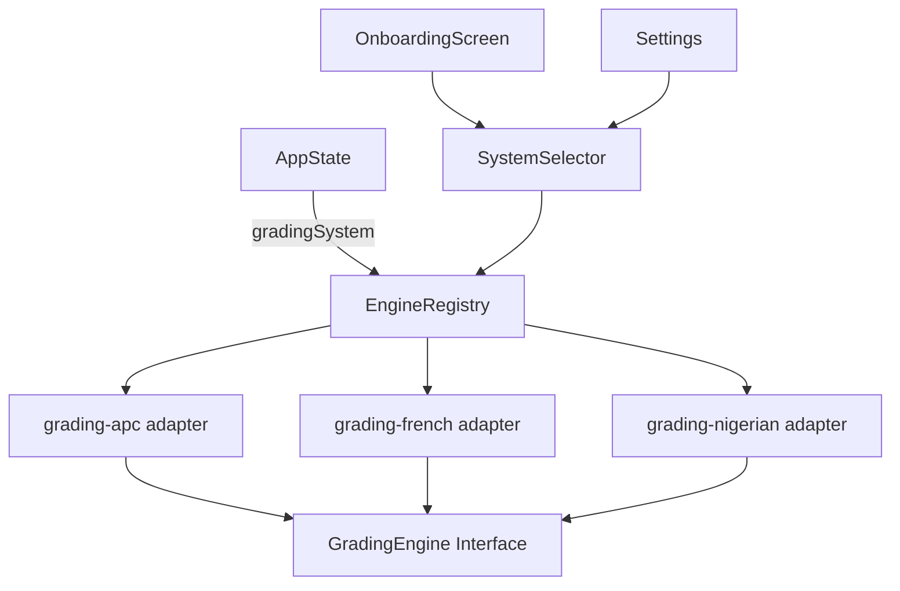

# Design Document: Multi-Educational System Support

## Overview

This feature extends the existing grade tracking app to support the Nigerian university grading system alongside the already-supported APC and French systems. The core challenge is introducing a fundamentally different grading paradigm — CGPA-based, credit-unit-weighted, semester/session-structured — without breaking existing functionality.

The design introduces a `GradingEngine` interface that all educational system adapters must implement, a new `nigerian_university` adapter, and an extended `AppState` that can carry Nigerian university data. The existing `apc` and `french` adapters are refactored to satisfy the same interface, ensuring the architecture is open for future systems.

---

## Architecture

The system follows an **adapter pattern** with a shared interface. Each educational system is a self-contained module that:
1. Declares its configuration (grade scale, score range, credit unit range, classification thresholds)
2. Implements the `GradingEngine` interface
3. Registers itself in a central `GRADING_ENGINES` registry

The `System_Selector` UI reads from the registry. The `AppState` carries a `gradingSystem` discriminant that determines which engine is active at runtime.



### Key Design Decisions

- **No changes to existing grading logic**: `grading-apc.ts` and `grading-french.ts` are wrapped, not modified.
- **Discriminated union for AppState**: Nigerian university data lives in a separate `nigerianState` field on `AppState`, keeping the existing `subjects` / `settings` fields intact for APC/French users.
- **Pure functions for all calculations**: The Nigerian grading engine is a set of pure functions, making it straightforward to test with property-based testing.
- **Registry pattern for extensibility**: Adding a new system requires only creating a new adapter file and registering it — no changes to core app logic.

---

## Components and Interfaces

### GradingEngine Interface

```typescript
// src/lib/grading-engine.ts
export interface SystemConfig {
  id: string;                        // e.g. "nigerian_university"
  label: string;                     // e.g. "Nigerian University"
  scoreRange: { min: number; max: number };
  creditUnitRange?: { min: number; max: number }; // only for credit-unit systems
  gradeScale: GradeScaleEntry[];
  classificationThresholds?: ClassificationThreshold[];
}

export interface GradeScaleEntry {
  minScore: number;
  maxScore: number;
  letter: string;
  points: number;
}

export interface ClassificationThreshold {
  minCGPA: number;
  label: string;
}

export interface GradingEngine {
  config: SystemConfig;
  /** Validate a raw score; returns null if valid, error string if invalid */
  validateScore(score: number): string | null;
  /** Validate credit units; returns null if valid, error string if invalid */
  validateCreditUnits?(creditUnits: number): string | null;
  /** Compute a single-course/subject result */
  computeCourseResult(score: number, creditUnits?: number): CourseResult;
  /** Compute a period-level average (semester GPA or term average) */
  computePeriodAverage(courses: CourseInput[]): number | null;
  /** Compute a cumulative average (CGPA or overall average) */
  computeCumulativeAverage(periods: CourseInput[][]): number | null;
}

export interface CourseInput {
  score: number;
  creditUnits?: number;
  coefficient?: number;
}

export interface CourseResult {
  letter: string;
  points: number;       // grade points (e.g. 5 for A)
  gradePoint?: number;  // GP = points × creditUnits (Nigerian only)
}
```

### Engine Registry

```typescript
// src/lib/grading-engine-registry.ts
import { GradingEngine } from './grading-engine';
import { apcEngine } from './grading-apc-adapter';
import { frenchEngine } from './grading-french-adapter';
import { nigerianEngine } from './grading-nigerian';

export const GRADING_ENGINES: Record<string, GradingEngine> = {
  apc: apcEngine,
  french: frenchEngine,
  nigerian_university: nigerianEngine,
};

export function getEngine(systemId: string): GradingEngine {
  return GRADING_ENGINES[systemId] ?? GRADING_ENGINES['apc'];
}
```

### Nigerian University Grading Engine

```typescript
// src/lib/grading-nigerian.ts
export function scoreToGrade(score: number): { letter: string; points: number }
export function computeGP(score: number, creditUnits: number): number
export function computeSemesterGPA(courses: NigerianCourse[]): number
export function computeCGPA(semesters: NigerianSemester[]): number
export function computeRequiredGPA(
  targetCGPA: number,
  completedCreditUnits: number,
  cumulativeGP: number,
  remainingCreditUnits: number
): number | null
export function classifyDegree(cgpa: number): string
```

### System Selector Component

The existing `OnboardingScreen` system step is extended to include the `nigerian_university` option. A shared `SystemSelectorCard` component is extracted for reuse in both onboarding and settings.

### Nigerian University Dashboard

A new `NigerianDashboard` page/component renders:
- Session/semester tree with per-semester GPA
- CGPA and Class of Degree badge
- Target CGPA input and Required GPA display
- Course entry form per semester

---

## Data Models

### Extended GradingSystem Type

```typescript
// src/types/exam.ts (extended)
export type GradingSystem = "apc" | "french" | "nigerian_university";
```

### Nigerian University Data Structures

```typescript
// src/types/nigerian.ts

export interface NigerianCourse {
  id: string;
  name: string;
  creditUnits: number;   // 1–6
  score: number;         // 0–100
  letter: string;        // computed: A/B/C/D/E/F
  gradePoints: number;   // computed: 5/4/3/2/1/0
  gp: number;            // computed: gradePoints × creditUnits
}

export interface NigerianSemester {
  id: string;
  name: string;          // e.g. "First Semester"
  sessionLabel: string;  // e.g. "2023/2024"
  courses: NigerianCourse[];
  gpa: number;           // computed
}

export interface NigerianState {
  semesters: NigerianSemester[];
  cgpa: number;                    // computed
  classOfDegree: string;           // computed
  targetCGPA: number | null;       // user-set, 0.00–5.00
  remainingCreditUnits: number;    // user-set
}
```

### Extended AppState

```typescript
// src/types/exam.ts (extended)
export interface AppState {
  // ... existing fields unchanged ...
  nigerianState?: NigerianState;   // only populated when gradingSystem === "nigerian_university"
}
```

### Serialisation Contract

The `NigerianState` object is stored as part of `AppState` in `localStorage` under the existing `scoretarget_state` key and synced to `user_app_state.state_json` in Supabase. No schema migration is required — the JSONB column already accepts arbitrary JSON.

---

## Correctness Properties

*A property is a characteristic or behavior that should hold true across all valid executions of a system — essentially, a formal statement about what the system should do. Properties serve as the bridge between human-readable specifications and machine-verifiable correctness guarantees.*

### Property 1: Grade scale coverage

*For any* integer score in the range 0–100, `scoreToGrade` SHALL return a letter grade and a non-negative grade points value, and the returned letter SHALL be one of {A, B, C, D, E, F}.

**Validates: Requirements 2.2**

### Property 2: GP computation is credit-unit-weighted

*For any* valid score and credit unit value (1–6), the computed GP SHALL equal `gradePoints(score) × creditUnits`.

**Validates: Requirements 2.3**

### Property 3: Semester GPA is a weighted mean

*For any* non-empty list of courses with valid scores and credit units, the computed semester GPA SHALL equal `sum(GP_i) / sum(creditUnits_i)`, rounded to two decimal places.

**Validates: Requirements 3.2**

### Property 4: Empty semester GPA is zero

*For any* empty course list, `computeSemesterGPA` SHALL return 0.00.

**Validates: Requirements 3.4**

### Property 5: CGPA is a weighted mean across all semesters

*For any* non-empty collection of semesters (each with at least one course), the computed CGPA SHALL equal `sum(all GP values) / sum(all credit units)`, rounded to two decimal places.

**Validates: Requirements 4.1**

### Property 6: Class of degree is monotone in CGPA

*For any* two CGPA values A and B where A ≥ B, the class of degree derived from A SHALL be greater than or equal to (i.e., not lower than) the class of degree derived from B.

**Validates: Requirements 4.4**

### Property 7: Required GPA round-trip

*For any* valid target CGPA, completed credit units, cumulative GP, and remaining credit units (> 0), if a student achieves exactly the computed `requiredGPA` in all remaining credit units, the resulting CGPA SHALL equal the target CGPA (within floating-point tolerance of 0.005).

**Validates: Requirements 5.2**

### Property 8: Score validation rejects out-of-range values

*For any* integer outside 0–100, `validateScore` SHALL return a non-null error string; *for any* integer in 0–100, it SHALL return null.

**Validates: Requirements 2.4**

### Property 9: Credit unit validation rejects out-of-range values

*For any* integer outside 1–6, `validateCreditUnits` SHALL return a non-null error string; *for any* integer in 1–6, it SHALL return null.

**Validates: Requirements 2.5**

### Property 10: NigerianState serialisation round-trip

*For any* valid `NigerianState` object, serialising it to JSON and deserialising it SHALL produce a structurally equivalent object (same semesters, courses, CGPA, targetCGPA, remainingCreditUnits).

**Validates: Requirements 6.4, 7.1**

---

## Error Handling

| Scenario | Handling |
|---|---|
| Score outside 0–100 | `validateScore` returns error string; UI shows inline validation message; calculation is blocked |
| Credit units outside 1–6 | `validateCreditUnits` returns error string; UI shows inline validation message |
| `remainingCreditUnits === 0` when computing Required GPA | `computeRequiredGPA` returns `null`; UI shows final CGPA and Class of Degree instead |
| Required GPA > 5.00 | UI displays "Target unachievable" indicator |
| Unknown `gradingSystem` in stored state | `getEngine` falls back to `apc`; app displays notification to user (Requirement 1.4) |
| Cloud/local system mismatch on login | App prompts user to choose which value to keep (Requirement 7.4) |
| Malformed `nigerianState` in stored JSON | Caught during `loadState`; `nigerianState` is reset to a default empty state |

---

## Testing Strategy

### Unit Tests (example-based)

- `scoreToGrade`: boundary values (0, 39, 40, 44, 45, 49, 50, 59, 60, 69, 70, 100)
- `computeRequiredGPA`: zero remaining credit units returns null; required GPA > 5 scenario
- `classifyDegree`: each threshold boundary (4.50, 3.50, 2.40, 1.50, 1.00, 0.99)
- `getEngine("unknown_system")` falls back to `apc`
- System selector renders all three systems during onboarding

### Property-Based Tests

Using **fast-check** (already a common choice in TypeScript/Vite projects). Each property test runs a minimum of **100 iterations**.

| Test | Property | Tag |
|---|---|---|
| Grade scale coverage | Property 1 | `Feature: multi-educational-system-support, Property 1` |
| GP computation | Property 2 | `Feature: multi-educational-system-support, Property 2` |
| Semester GPA weighted mean | Property 3 | `Feature: multi-educational-system-support, Property 3` |
| Empty semester GPA | Property 4 | `Feature: multi-educational-system-support, Property 4` |
| CGPA weighted mean | Property 5 | `Feature: multi-educational-system-support, Property 5` |
| Class of degree monotonicity | Property 6 | `Feature: multi-educational-system-support, Property 6` |
| Required GPA round-trip | Property 7 | `Feature: multi-educational-system-support, Property 7` |
| Score validation | Property 8 | `Feature: multi-educational-system-support, Property 8` |
| Credit unit validation | Property 9 | `Feature: multi-educational-system-support, Property 9` |
| NigerianState serialisation round-trip | Property 10 | `Feature: multi-educational-system-support, Property 10` |

### Integration Tests

- Saving and loading `AppState` with `nigerianState` via `localStorage` round-trip
- Cloud sync: `saveAppStateToCloud` / `loadAppStateFromCloud` with Nigerian state payload
- System conflict resolution prompt when cloud and local `gradingSystem` differ

### What is NOT property-tested

- UI rendering (OnboardingScreen, NigerianDashboard) — snapshot tests instead
- Cloud sync wiring — integration tests with 1–2 representative examples
- System selector display — example-based component tests
